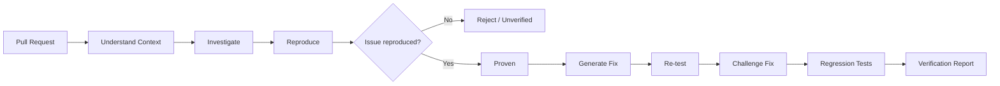
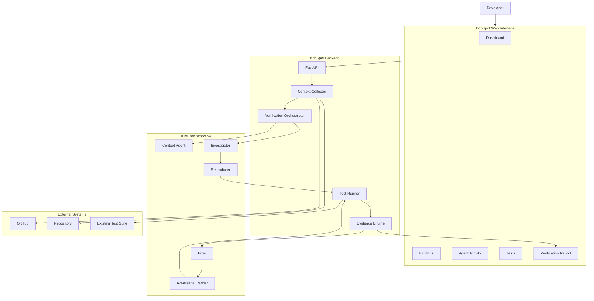
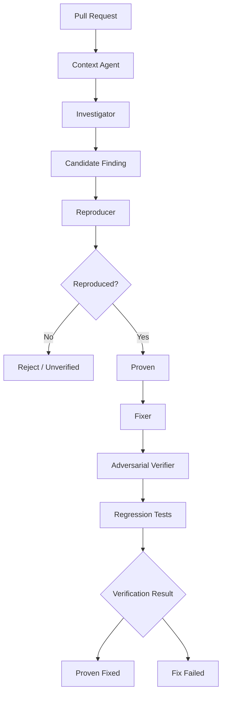
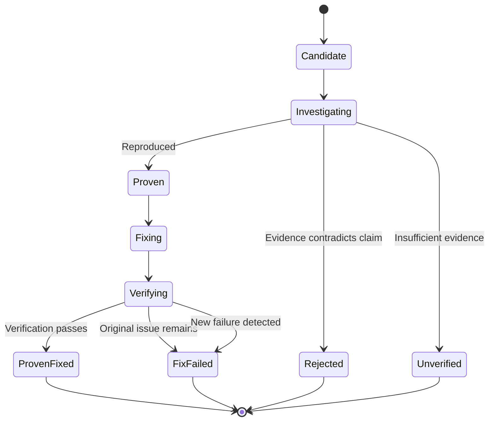
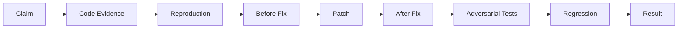
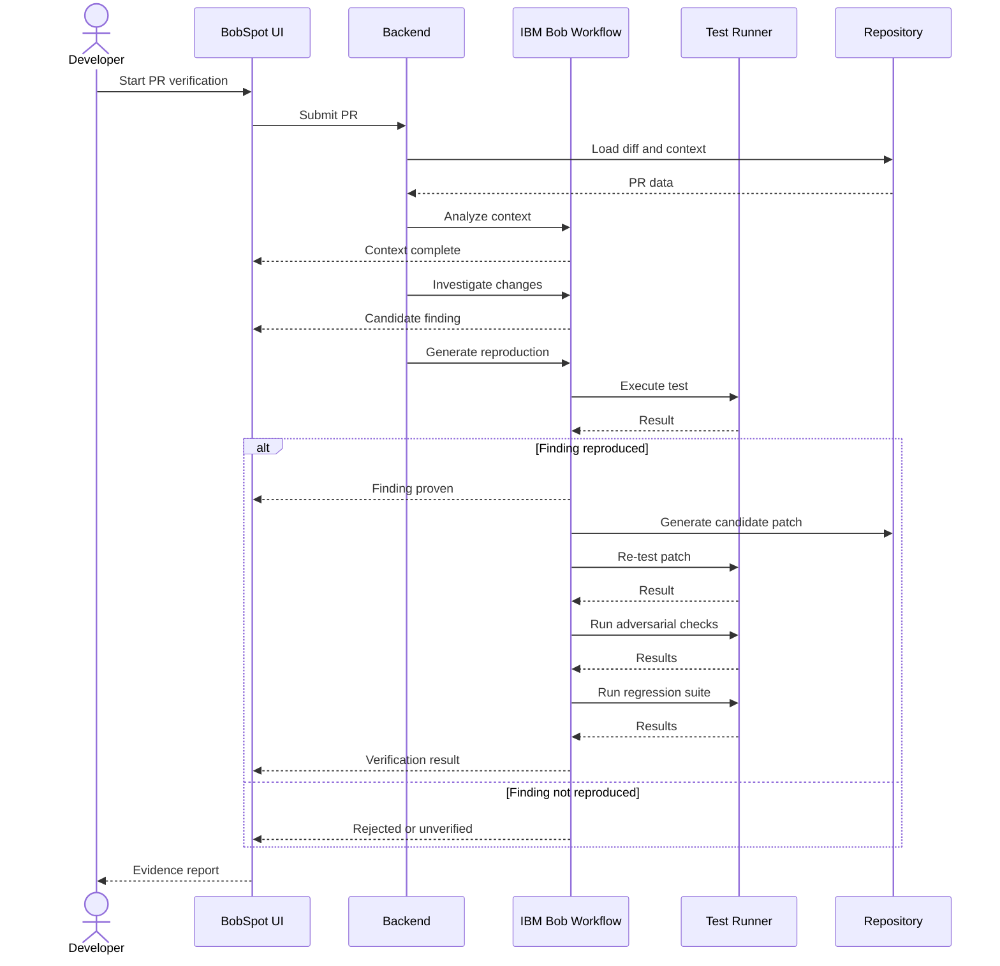
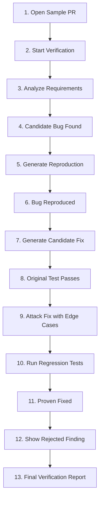

<div align="center">

# BobSpot

### Evidence-Backed Multi-Agent Pull Request Verification

**Don't just trust an AI code review. Make it prove the finding.**

[](#current-status)
[](#mvp-roadmap)
[](#ibm-bob-agent-workflow)

BobSpot is an evidence-backed multi-agent pull request verification system built around IBM Bob.

Instead of stopping at *"this might be a bug"*, BobSpot investigates the claim, attempts to reproduce the problem, generates a focused fix, challenges that fix with additional tests, runs regression checks, and preserves the evidence behind the final result.

**Mission: Move AI-assisted code review from suggestions to verifiable evidence.**

</div>

---

## The Challenge

AI tools can write code, review pull requests, and suggest fixes quickly.

But there is an important gap.

An AI reviewer can say:

> **"This change may introduce a bug."**

That does not prove the bug actually exists.

Likewise:

> **"I fixed the issue."**

does not prove that the proposed change solves the problem without breaking something else.

Developers may still need to manually:

| Challenge                | Why it matters                                                       |
| ------------------------ | -------------------------------------------------------------------- |
| Investigate findings     | AI review comments can be incomplete or incorrect                    |
| Reproduce suspected bugs | A plausible explanation is not executable evidence                   |
| Validate generated fixes | A patch can solve one case while breaking another                    |
| Test edge cases          | The obvious test case may not expose boundary problems               |
| Run regression tests     | Existing functionality must continue working                         |
| Track evidence           | Developers need to understand why a finding was accepted or rejected |

The central question behind BobSpot is:

<div align="center">

### Can an AI system prove or disprove its own code-review findings?

</div>

---

## Our Solution

BobSpot introduces an **evidence-first verification workflow** around pull-request review.

```text id="w0o4vo"
Claim
  |
  v
Evidence
  |
  v
Reproduction
  |
  +---------- Cannot reproduce ----------> Rejected / Unverified
  |
  v
Confirmed
  |
  v
Generate Fix
  |
  v
Re-run Reproduction
  |
  v
Adversarial Verification
  |
  v
Regression Tests
  |
  v
Evidence-Backed Result
```

The core principle is:

<div align="center">

## Evidence > Agent Agreement

**A review comment is a claim. BobSpot tries to turn that claim into evidence.**

</div>

---

## Key Features

| Feature                       | What it does                                                                 | MVP Status |
| ----------------------------- | ---------------------------------------------------------------------------- | ---------- |
| **PR Context Analysis**       | Reads the PR, changed files, requirements and relevant repository context    | Target     |
| **Independent Investigation** | Searches for logical bugs, requirement violations and risky edge cases       | Target     |
| **Automatic Reproduction**    | Attempts to generate an executable test for a suspected defect               | Target     |
| **False-Positive Filtering**  | Allows unsupported AI findings to be rejected                                | Target     |
| **Focused Fix Generation**    | Creates a focused patch for reproduced issues                                | Target     |
| **Adversarial Verification**  | Generates additional scenarios designed to challenge the fix                 | Target     |
| **Regression Testing**        | Runs existing tests after proposed changes                                   | Target     |
| **IBM Bob Agent Workflow**    | Coordinates specialized Bob responsibilities across the verification process | Target     |
| **Live Agent Activity**       | Displays the verification process in the dashboard                           | Planned    |
| **Evidence Explorer**         | Connects findings with code, tests, patches and results                      | Planned    |
| **Proof Trail**               | Records the sequence of verification actions                                 | Planned    |
| **Verification Report**       | Summarizes reproduced, rejected, fixed and unresolved findings               | Planned    |
| **GitHub Integration**        | Loads PR information and changed code                                        | Target     |
| **Automatic PR Comments**     | Publishes verification results back to the PR                                | Future     |

> BobSpot is currently under development as a hackathon MVP. Features marked **Target**, **Planned**, or **Future** should not be interpreted as completed functionality.

---

## How It Works



A conventional AI review may end with:

```text id="upv6ko"
Code -> AI Review -> Finding
```

BobSpot continues:

```text id="x8q6m2"
Code
 |
 v
Candidate Finding
 |
 v
Executable Reproduction
 |
 v
Evidence
 |
 v
Patch
 |
 v
Counter-tests
 |
 v
Regression
 |
 v
Verified Result
```

---

## System Architecture



---

## IBM Bob Agent Workflow



### Agent Responsibilities

| Agent                    | Responsibility                                                    | Expected Output          |
| ------------------------ | ----------------------------------------------------------------- | ------------------------ |
| **Context Agent**        | Understand the PR, issue, requirements and repository conventions | Structured context       |
| **Investigator**         | Identify suspicious behavior and potential defects                | Candidate findings       |
| **Reproducer**           | Attempt to trigger each suspected problem                         | Executable reproduction  |
| **Fixer**                | Generate a focused patch for reproduced issues                    | Proposed change          |
| **Adversarial Verifier** | Try to break the proposed fix using additional scenarios          | Edge-case results        |
| **Regression Runner**    | Execute existing repository tests                                 | Execution evidence       |
| **Orchestrator**         | Coordinate states and assemble evidence                           | Final verification trail |

---

## Finding Verification Lifecycle



| Status            | Meaning                                                          |
| ----------------- | ---------------------------------------------------------------- |
| **Candidate**     | An agent suspects a problem                                      |
| **Investigating** | Evidence is being collected                                      |
| **Proven**        | The suspected behavior was reproduced                            |
| **Proven Fixed**  | The original issue no longer reproduces and required checks pass |
| **Rejected**      | Evidence contradicts the original claim                          |
| **Unverified**    | There is insufficient evidence to reach a conclusion             |
| **Fix Failed**    | The proposed fix did not pass verification                       |

---

## Evidence Model



Each finding can contain:

```text id="dmbsag"
Finding
|
+-- Claim
+-- Severity
+-- File and line references
+-- Supporting context
+-- Reproduction test
+-- Before-fix result
+-- Proposed patch
+-- After-fix result
+-- Adversarial tests
+-- Regression results
+-- Final status
```

---

## User Journey

|   Step | User Experience                     | System Responsibility                       |
| -----: | ----------------------------------- | ------------------------------------------- |
|  **1** | Enter a repository and PR           | Load PR metadata and changed files          |
|  **2** | Start verification                  | Collect requirements and repository context |
|  **3** | Watch agent activity                | Coordinate verification tasks               |
|  **4** | Inspect candidate findings          | Display claims and supporting code          |
|  **5** | Open reproduction result            | Execute generated reproduction              |
|  **6** | Check whether the finding is proven | Compare expected and observed behavior      |
|  **7** | Inspect proposed patch              | Generate focused change                     |
|  **8** | Watch Bob challenge the fix         | Generate additional scenarios               |
|  **9** | Review regression results           | Run existing test suite                     |
| **10** | Open verification trail             | Present evidence and final state            |

---

## User Interface

BobSpot is designed as a developer dashboard rather than a chatbot.

### Main Dashboard

```text id="61nbmd"
+----------------------------------------------------------------+
| BobSpot                              shop-api / Pull Request #42 |
+---------------+------------------------------------------------+
|               |                                                |
| Overview      |  Pull Request Verification                     |
| Findings      |                                                |
| Agents        |  +----------+ +----------+ +----------+        |
| Tests         |  | Findings | |  Proven  | | Rejected |        |
| Changes       |  |    7     | |    4     | |    2     |        |
| Proof Trail   |  +----------+ +----------+ +----------+        |
| Report        |                                                |
|               |  Verification Pipeline                         |
|               |                                                |
|               |  Context           Complete                    |
|               |      |                                         |
|               |      v                                         |
|               |  Investigation     Complete                    |
|               |      |                                         |
|               |      v                                         |
|               |  Reproduction      Running                     |
|               |      |                                         |
|               |      v                                         |
|               |  Verification      Waiting                     |
|               |                                                |
+---------------+------------------------------------------------+
```

> The numbers above illustrate the intended interface and are not performance claims.

### Finding Detail

```text id="xvv9vf"
+---------------------------------------------------------------+
| Finding #03                                      PROVEN FIXED |
|                                                               |
| Expired coupons can be accepted                               |
|                                                               |
| Severity     HIGH                                             |
| File         src/services/coupon.service.ts                   |
+---------------------------------------------------------------+
| CLAIM                                                         |
|                                                               |
| Expiration is not validated before applying the discount.     |
+---------------------------------------------------------------+
| REPRODUCTION                                                  |
|                                                               |
| Scenario        Coupon expired yesterday                      |
| Expected        Reject coupon                                 |
| Before Fix      Problem reproduced                            |
+---------------------------------------------------------------+
| PATCH                                                         |
|                                                               |
| + if (coupon.expiresAt < new Date())                          |
| +     throw new ExpiredCoupon()                               |
+---------------------------------------------------------------+
| VERIFICATION                                                  |
|                                                               |
| Original reproduction       PASS                              |
| Boundary scenarios          PASS                              |
| Existing regression tests   PASS                              |
+---------------------------------------------------------------+
|                         PROVEN FIXED                          |
+---------------------------------------------------------------+
```

---

## Adversarial Verification

Generating a fix is not the final step.

BobSpot asks:

> **"How could this fix still fail?"**

```text id="7nvs7l"
                    Proposed Fix
                         |
           +-------------+--------------+
           |             |              |
           v             v              v
     Past timestamp   Exact boundary   Future date
           |             |              |
           +-------------+--------------+
                         |
                 +-------+--------+
                 |                |
                 v                v
             Null value       Disabled item
                 |                |
                 +-------+--------+
                         |
                         v
                Verification Result
```

The scenarios depend on the repository and the specific finding.

---

## Conflict Resolution

BobSpot does not rely only on agent voting.

```text id="yn2a03"
Investigator
     |
     +----> "Possible authorization bypass"
                         |
                         v
                    Reproducer
                         |
              Unauthorized request
                         |
                         v
                     HTTP 403
                         |
                         v
              Claim not reproduced
```

<div align="center">

### Evidence > Agent Vote

</div>

---

## Technology Stack

> This represents the target architecture for the hackathon MVP. Components should be marked as implemented only after integration is complete.

### Frontend

| Technology        | Purpose                        |
| ----------------- | ------------------------------ |
| **React**         | Dashboard interface            |
| **TypeScript**    | Type-safe frontend development |
| **Vite**          | Development and build tooling  |
| **Tailwind CSS**  | Responsive styling             |
| **shadcn/ui**     | Interface components           |
| **React Flow**    | Workflow visualization         |
| **Framer Motion** | Small interface transitions    |
| **Lucide**        | Consistent interface icons     |

### Backend

| Technology          | Purpose                         |
| ------------------- | ------------------------------- |
| **Python**          | Backend and orchestration       |
| **FastAPI**         | REST API                        |
| **Pydantic**        | Request and response validation |
| **WebSocket / SSE** | Live verification events        |
| **SQLite**          | MVP persistence                 |
| **Test Runner**     | Controlled execution of tests   |

### Agentic Workflow

| Technology                    | Purpose                         |
| ----------------------------- | ------------------------------- |
| **IBM Bob**                   | Agentic workflow capabilities   |
| **Verification Orchestrator** | Coordinates verification stages |
| **Generated Tests**           | Attempts to reproduce findings  |
| **Adversarial Checks**        | Challenges generated fixes      |

### Integration

| Technology                    | Purpose                             |
| ----------------------------- | ----------------------------------- |
| **GitHub API**                | Repository and pull-request context |
| **Git**                       | Diff and source inspection          |
| **Repository Test Framework** | Runs existing and generated tests   |

---

## Live Verification Flow



---

## What BobSpot Measures

BobSpot is designed to report factual execution data rather than arbitrary AI confidence scores.

| Measurement           | Source                   |
| --------------------- | ------------------------ |
| Candidate findings    | Investigator output      |
| Reproduced findings   | Test execution           |
| Rejected findings     | Contradicting evidence   |
| Unverified findings   | Insufficient evidence    |
| Generated tests       | Test-generation workflow |
| Passing/failing tests | Test runner              |
| Regression results    | Existing test suite      |
| Verification duration | Workflow timestamps      |

---

## Current Status

**Hackathon MVP — Active Development**

### Current

* Product problem defined
* Verification workflow designed
* Agent responsibilities defined
* System architecture designed
* MVP scope defined
* Dashboard UX designed

### Target for MVP

* GitHub PR ingestion
* Context extraction
* IBM Bob workflow integration
* Candidate finding generation
* Reproduction-test generation
* Test execution
* Focused patch generation
* Adversarial verification
* Regression execution
* Evidence dashboard
* Final verification report

### Future

* GitHub App integration
* Automatic PR review comments
* CI/CD integration
* Multi-repository history
* Team policies
* Configurable verification rules
* Broader language and framework support

---

## MVP Roadmap

### Phase 1 — Foundation

* [ ] Initialize frontend application
* [ ] Initialize FastAPI backend
* [ ] Create dashboard shell
* [ ] Add repository / PR input
* [ ] Integrate GitHub PR retrieval
* [ ] Parse changed files and diff
* [ ] Define finding data model
* [ ] Add verification-run persistence

### Phase 2 — Verification Engine

* [ ] Connect IBM Bob workflow
* [ ] Implement context analysis
* [ ] Implement investigation
* [ ] Generate candidate findings
* [ ] Implement reproduction workflow
* [ ] Execute generated tests
* [ ] Classify findings
* [ ] Generate focused patches
* [ ] Re-run reproduction after patch
* [ ] Add adversarial verification
* [ ] Execute regression suite

### Phase 3 — Experience and Demo

* [ ] Build live agent activity view
* [ ] Build findings dashboard
* [ ] Add code evidence viewer
* [ ] Add diff viewer
* [ ] Build test-results screen
* [ ] Build verification timeline
* [ ] Build final verification report
* [ ] Add error and timeout handling
* [ ] Prepare reproducible demo repository
* [ ] Test complete end-to-end workflow
* [ ] Document limitations

---

## Target Demo Flow



---

## Target Project Structure

```text id="brqkpz"
bobspot/
|
+-- frontend/
|   +-- src/
|   |   +-- components/
|   |   |   +-- dashboard/
|   |   |   +-- findings/
|   |   |   +-- agents/
|   |   |   +-- tests/
|   |   |   +-- reports/
|   |   +-- pages/
|   |   +-- hooks/
|   |   +-- services/
|   |   +-- types/
|   |   +-- utils/
|   +-- package.json
|   +-- vite.config.ts
|
+-- backend/
|   +-- app/
|   |   +-- api/
|   |   +-- agents/
|   |   +-- orchestrator/
|   |   +-- github/
|   |   +-- evidence/
|   |   +-- runner/
|   |   +-- models/
|   |   +-- services/
|   +-- tests/
|   +-- requirements.txt
|
+-- demo/
|   +-- sample-repository/
|
+-- docs/
|   +-- architecture/
|   +-- screenshots/
|
+-- .env.example
+-- README.md
```

---

## Local Setup / Quick Start

### Prerequisites

* Git
* Python 3.11+
* Node.js 20+
* npm
* Required IBM Bob access
* GitHub token if authenticated GitHub API access is enabled

### 1. Clone the Repository

```bash id="zavuvj"
git clone <YOUR_REPOSITORY_URL>
cd bobspot
```

### 2. Configure Environment Variables

```bash id="9scu8i"
cp .env.example .env
```

Example:

```env id="7s1epw"
GITHUB_TOKEN=your_github_token
DATABASE_URL=sqlite:///./bobspot.db
FRONTEND_URL=http://localhost:5173
BACKEND_URL=http://localhost:8000
```

Never commit real tokens or secrets.

### 3. Start the Backend

```bash id="x55ljz"
cd backend
python -m venv .venv
```

Windows PowerShell:

```powershell id="tkxvs9"
.venv\Scripts\Activate.ps1
```

Windows Git Bash:

```bash id="30d1fa"
source .venv/Scripts/activate
```

macOS / Linux:

```bash id="tkrccf"
source .venv/bin/activate
```

Install dependencies:

```bash id="n6irvb"
pip install -r requirements.txt
```

Run the backend:

```bash id="yhc79b"
uvicorn app.main:app --reload --port 8000
```

### 4. Start the Frontend

```bash id="kmurto"
cd frontend
npm install
npm run dev
```

### 5. Run Tests

Backend:

```bash id="b2tvgn"
cd backend
pytest
```

Frontend:

```bash id="n1lcz3"
cd frontend
npm run lint
npm run build
```

---

## Design Principles

### Evidence before confidence

BobSpot prefers observable execution results over unsupported confidence scores.

### Reproduce before fixing

Whenever practical, establish the failure before generating a patch.

### Verify the verifier

Generated fixes are challenged rather than automatically trusted.

### Preserve human visibility

Developers should be able to inspect claims, evidence, tests, patches and results.

### Reject unsupported findings

BobSpot must be capable of concluding that an original suspicion was not supported.

### Keep the MVP focused

The goal is to demonstrate the complete:

```text id="ukewi4"
Claim -> Evidence -> Reproduction -> Fix -> Challenge -> Regression -> Verification
```

loop clearly.

---

## What BobSpot Is Not

BobSpot is not:

* A replacement for human code review
* A guarantee that software contains no bugs
* A generic AI chatbot
* A vulnerability certification platform
* An automatic production deployment system
* Proof that every unreproduced finding is false

A finding can remain **Unverified** when the available evidence is insufficient.

---

## Contributing

Contributions, bug reports, documentation improvements, and design suggestions are welcome.

1. Fork the repository.
2. Create a feature branch.

```bash id="sz4gpk"
git checkout -b feature/your-feature
```

3. Make your changes.
4. Run relevant tests.
5. Commit your changes.

```bash id="c7sgwg"
git commit -m "feat: describe your change"
```

6. Push your branch.

```bash id="yfvx8q"
git push origin feature/your-feature
```

7. Open a Pull Request explaining what changed, why it changed, and how it was tested.

---

<div align="center">

# BobSpot

### Don't trust the review. Verify it.

**Claim -> Evidence -> Reproduction -> Fix -> Challenge -> Regression -> Verification**

Built for the **IBM Bob 2.0 Hackathon**

</div>
