<div align="center">

# BobSpot

### **Spot it. Test it. Prove it.**

<p align="center">
  
</p>

### Evidence-Backed Multi-Agent Pull Request Verification

**Don't just trust an AI code review. Make it prove the finding.**

[](https://www.ibm.com/)
[](https://www.python.org/)
[](https://react.dev/)
[](https://fastapi.tiangolo.com/)

<br/>

**Claim → Evidence → Reproduction → Fix → Challenge → Regression → Proof**

<br/>

Built for the **IBM Bob 2.0 Hackathon**.

</div>

---

## What is BobSpot?

BobSpot is an **evidence-backed, multi-agent pull request verification system powered by IBM Bob**.

AI coding assistants can generate and review code quickly. But an AI-generated review comment is still only a **claim** until there is evidence behind it.

BobSpot adds a verification layer that:

- understands the pull request and its requirements
- investigates suspicious changes
- collects code-level evidence
- generates executable reproductions
- confirms or rejects suspected issues
- creates focused fixes
- attacks those fixes with adversarial scenarios
- runs regression tests
- preserves the complete verification trail

> **Core idea:** A claim is not a confirmed finding until evidence supports it.

---

# The Problem

AI-assisted development has made writing and reviewing software much faster.

But when an AI reviewer says:

> **"This change can allow an expired coupon to be accepted."**

the developer still needs to determine:

| Question | Why it matters |
|---|---|
| Is the issue real? | AI findings can be false positives |
| Where is the problem? | Developers need source-level evidence |
| Can it be reproduced? | A plausible explanation is not executable proof |
| Does the fix actually work? | A patch can solve one case and miss another |
| What edge cases break the fix? | Boundary conditions often hide regressions |
| Did the fix break existing behavior? | Passing the original test is not enough |

### Traditional AI Review

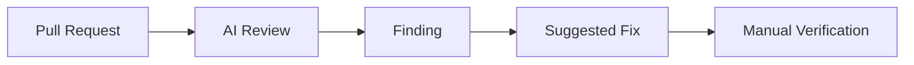

### BobSpot

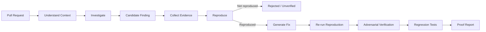

### The question is no longer only:

> **Can AI review the code?**

### It is:

> **Can AI prove that its review is correct?**

---

# The Solution

BobSpot turns an AI-generated review into an **evidence-backed verification workflow**.

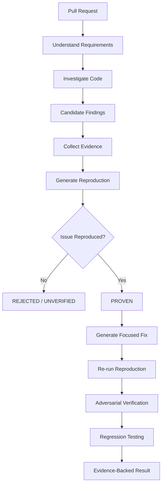

## The verification principle

> **Evidence > Agent Agreement**

Multiple agents agreeing with one another is useful context.

An executable reproduction, source evidence, and test results provide stronger support for the conclusion.

---

# How BobSpot Works

BobSpot separates responsibilities across specialized verification agents instead of asking one agent to do everything.

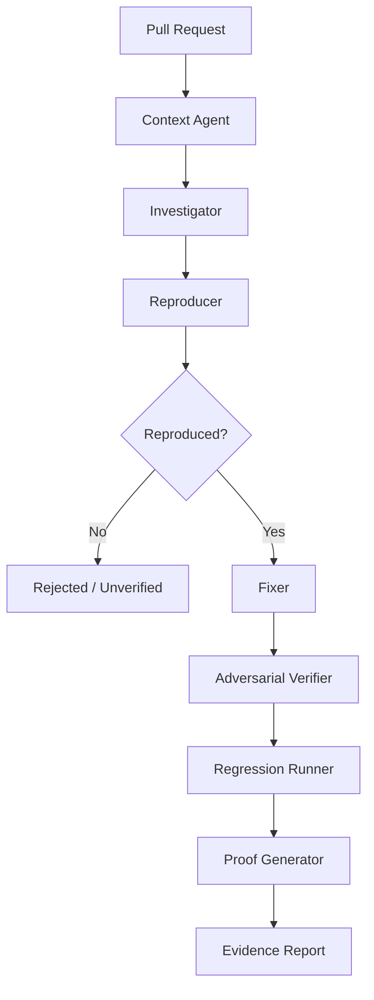

| Agent | Responsibility | Output |
|---|---|---|
| **Context Agent** | Understand PR, issue, requirements and repository conventions | Structured context |
| **Investigator** | Search for logical bugs, requirement violations and risky behavior | Candidate findings |
| **Reproducer** | Attempt to trigger the suspected issue | Executable reproduction |
| **Fixer** | Generate the smallest reasonable patch | Proposed fix |
| **Adversarial Verifier** | Try to break the proposed fix | Edge-case results |
| **Regression Runner** | Run existing repository tests | Regression evidence |
| **Proof Generator** | Assemble all evidence | Verification report |

---

# Workflow

<p align="center">
  
</p>

## 1. Understand the Requirement

The Context Agent determines what the pull request is actually supposed to accomplish.

It can use:

- Pull request description
- Issue description
- README/documentation
- Repository conventions
- Acceptance criteria
- Changed files

Example:

```json
{
  "requirement": "Expired coupons must be rejected",
  "affected_modules": [
    "coupon.service.ts"
  ],
  "acceptance_criteria": [
    "active coupon accepted",
    "expired coupon rejected"
  ]
}
```

This context becomes the foundation for the rest of the verification pipeline.

---

## 2. Investigate the Change

The Investigator searches changed code for potential problems.

It can look for:

- Logical bugs
- Requirement violations
- Edge cases
- Error-handling problems
- Security issues
- Unexpected side effects

Example:

```text
Finding:
Expired coupons may still be accepted.

Evidence:
coupon.service.ts:84

Reason:
The validation checks whether the coupon is enabled
but does not compare expiresAt with the current time.
```

At this stage:

```text
Candidate ≠ Confirmed
```

---

## 3. Reproduce the Finding

The Reproducer attempts to prove or disprove the candidate finding.

Example:

```text
Scenario:
Coupon expired yesterday

Expected:
CouponRejectedError

Actual:
Coupon accepted

Result:
✓ ISSUE REPRODUCED
```

If the issue cannot be reproduced, BobSpot does **not** automatically treat the AI claim as a confirmed defect.

---

## 4. Generate a Focused Fix

Only after sufficient evidence exists, the Fixer generates a minimal patch.

Principles:

1. Make the smallest reasonable change
2. Preserve existing architecture
3. Avoid unrelated refactoring

Example:

```diff
 if (!coupon.enabled)
     throw new InvalidCoupon()

+if (coupon.expiresAt < new Date())
+    throw new ExpiredCoupon()

 return applyDiscount(coupon)
```

---

## 5. Challenge the Fix

The fix is **not automatically trusted**.

The Adversarial Verifier asks:

> **What inputs could still make this fix fail?**

For the coupon example:

```text
                 Proposed Fix
                      │
       ┌──────────────┼──────────────┐
       ▼              ▼              ▼
  Expired date   Exact boundary   Future date
       │              │              │
       └──────────────┼──────────────┘
                      │
              ┌───────┴────────┐
              ▼                ▼
        Null expiration   Disabled coupon
              │                │
              └───────┬────────┘
                      ▼
              Verification Result
```

Example scenarios:

```text
✓ Expired coupon
✓ Current timestamp
✓ Future expiration
✓ Disabled coupon
✓ Null expiration
✓ Timezone boundary
```

---

## 6. Run Regression Tests

BobSpot runs existing repository tests alongside generated verification tests.

Example output:

```text
Existing Tests       47/47 PASS
Reproduction Tests     1/1 PASS
Adversarial Tests     6/6 PASS
```

> These numbers are illustrative examples of the interface, not project performance claims.

---

# Evidence > Agent Agreement

BobSpot does not simply majority-vote between agents.

Consider:

```text
Security Investigator
⚠ Potential vulnerability

Context Agent
✓ Authentication middleware exists

Reproducer
✕ Unauthorized request returns HTTP 403
```

Instead of asking:

> "Which agent has more votes?"

BobSpot asks:

> "What does the available evidence support?"

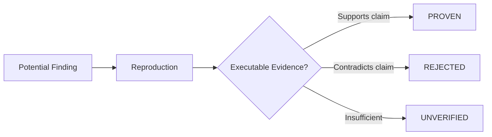

The goal is not to make agents agree.

The goal is to determine **what the evidence actually supports**.

---

# Finding Lifecycle

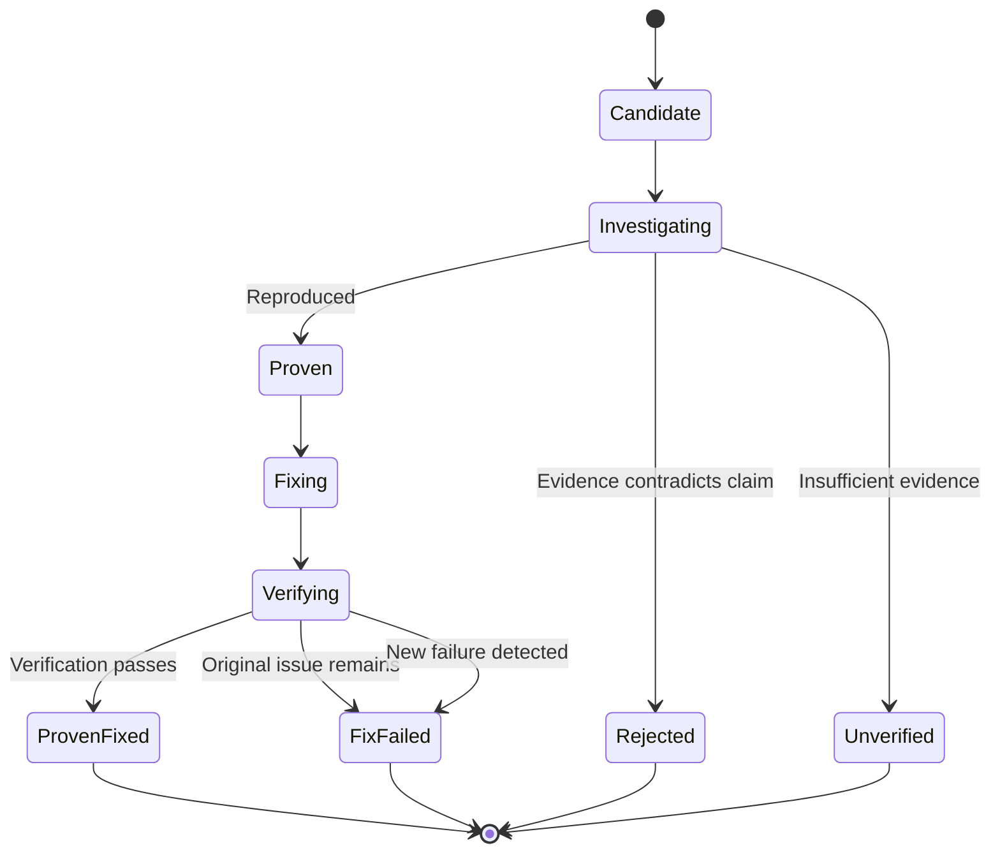

| Status | Meaning |
|---|---|
| **Candidate** | Potential issue identified |
| **Investigating** | Evidence is being collected |
| **Proven** | Suspected defect was reproduced |
| **Rejected** | Available evidence contradicts the claim |
| **Unverified** | Evidence is insufficient to reach a conclusion |
| **Proven Fixed** | Original issue is no longer reproduced and required checks pass |
| **Fix Failed** | Original issue remains or the fix fails verification |

---

# Example: Claim → Proof

Suppose a pull request adds coupon validation.

The Investigator identifies:

> **Expired coupons can still be accepted.**

### 1. Code Evidence

```text
coupon.service.ts:84

The validation checks whether the coupon is enabled
but does not validate expiration.
```

### 2. Reproduction

```text
Input:
Expired coupon

Expected:
Rejected

Actual:
Accepted

❌ BUG REPRODUCED
```

### 3. Fix

BobSpot generates a minimal patch adding expiration validation.

### 4. Adversarial Verification

```text
Expired coupon       ✓
Current timestamp    ✓
Future expiration    ✓
Disabled coupon      ✓
Null expiration      ✓
Timezone boundary    ✓
```

### 5. Regression

```text
Existing Tests        47/47 ✓
Generated Tests         7/7 ✓
```

### Final Result

```text
✓ PROVEN FIXED
```

The developer receives more than a review comment:

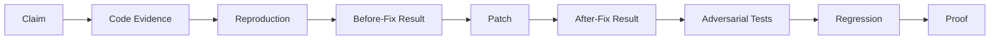

---

# Example: Rejecting a False Positive

BobSpot should also be able to demonstrate when an AI finding is **not supported**.

Example:

> **Potential null pointer in UserService**

The Investigator identifies a possible null user object.

The Reproducer cannot reproduce the problem.

BobSpot then discovers that authentication middleware guarantees a populated user object for the relevant route.

```text
Generated tests:
5/5 PASS

Final result:
✕ REJECTED

Reason:
The original finding did not account for
the authentication middleware contract.
```

This is an important part of the system:

> **BobSpot must be able to say "the evidence does not support this finding."**

---

# Product Experience

BobSpot is designed as a **developer verification workspace**, not a chatbot.

## Dashboard

```text
┌─────────────────────────────────────────────────────────────┐
│ BobSpot                    shop-api / Pull Request #42       │
├──────────────┬──────────────────────────────────────────────┤
│              │                                              │
│ Overview     │  Pull Request Verification                   │
│ Findings     │                                              │
│ Agents       │  ┌──────────┐ ┌──────────┐ ┌──────────┐     │
│ Tests        │  │ Findings │ │  Proven  │ │ Rejected │     │
│ Changes      │  │    7     │ │    4     │ │    2     │     │
│ Proof Trail  │  └──────────┘ └──────────┘ └──────────┘     │
│ Report       │                                              │
│              │  Verification Pipeline                       │
│              │                                              │
│              │  Context          ✓ Complete                 │
│              │      ↓                                       │
│              │  Investigation    ✓ Complete                 │
│              │      ↓                                       │
│              │  Reproduction     ● Running                  │
│              │      ↓                                       │
│              │  Verification     ○ Waiting                  │
│              │                                              │
└──────────────┴──────────────────────────────────────────────┘
```

> Interface numbers above are illustrative UI examples.

## Live Agent Activity

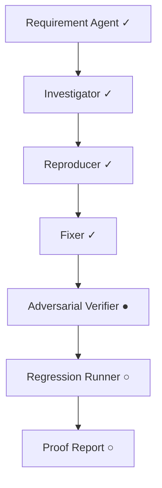

Developers can inspect the progress of individual agents instead of receiving a black-box final answer.

---

# Evidence-Backed Finding

A finding can carry its complete proof trail:

```text
┌──────────────────────────────────────────────┐
│ HIGH                     PROVEN FIXED        │
│                                              │
│ Expired coupons can be accepted              │
│                                              │
│ coupon.service.ts : 84                       │
│                                              │
│ Reproduced       ✓                           │
│ Fix applied      ✓                           │
│ Adversarial      6/6                         │
│ Regression       47/47                       │
│                                              │
│ [ View Proof ]  [ View Patch ]               │
└──────────────────────────────────────────────┘
```

A finding can contain:

- Claim
- Code evidence
- Reproduction test
- Before-fix result
- Proposed patch
- Adversarial tests
- Regression results
- Final status

---

# Verification Timeline

BobSpot preserves a chronological proof trail.

```text
10:41:02  PR analysis started
10:41:05  Requirements extracted
10:41:09  Finding #03 identified
10:41:14  Reproduction test generated
10:41:17  Test failed — bug confirmed
10:41:23  Patch generated
10:41:27  Reproduction test passed
10:41:32  Adversarial tests generated
10:41:38  6/6 adversarial tests passed
10:41:44  Regression suite completed
10:41:45  Finding marked PROVEN FIXED
```

This makes the verification process inspectable and auditable.

---

# Verification Report

At the end of a run, BobSpot can produce a consolidated report.

```text
BobSpot Verification Report
────────────────────────────────────

Repository: shop-api
Pull Request: #42

Potential Findings       9
Proven                    5
Rejected                  3
Unverified                1

Fixes Generated           5
Fixes Verified            5

Generated Tests          18
Tests Passed             18

Existing Tests          47/47
```

The report can contain:

- Findings
- Code evidence
- Reproduction results
- Generated patches
- Adversarial scenarios
- Regression results
- Final statuses
- Verification timeline

The developer remains in control of the final merge decision.

---

# System Architecture

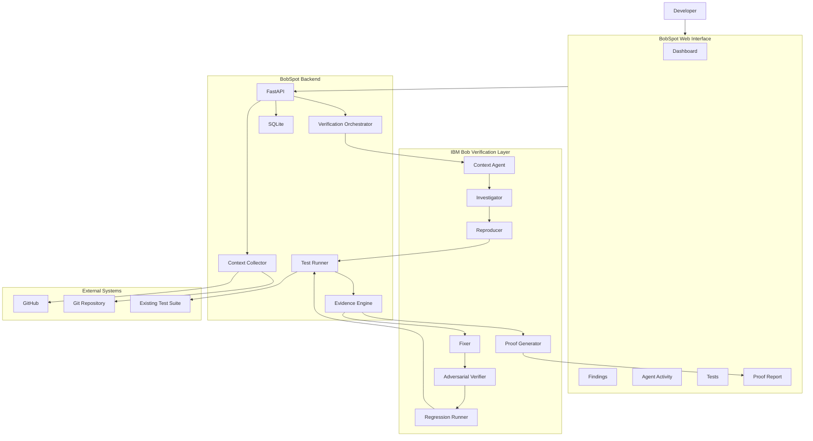

---

# End-to-End Sequence

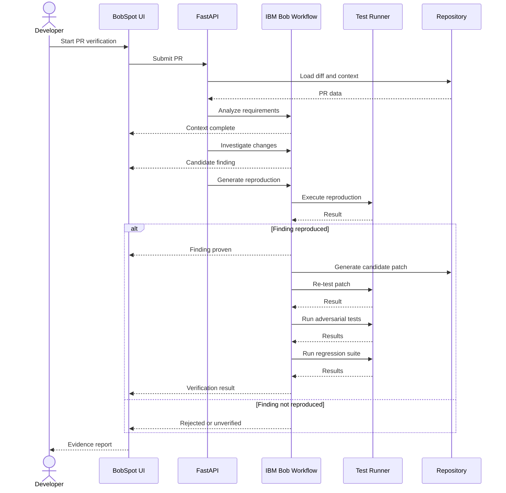

---

# Technology Stack

## Frontend

| Technology | Purpose |
|---|---|
| **React** | Dashboard UI |
| **TypeScript** | Type-safe frontend development |
| **Vite** | Development/build tooling |
| **Tailwind CSS** | Styling |
| **shadcn/ui** | UI components |
| **React Flow** | Workflow visualization |
| **Framer Motion** | Interface transitions |
| **Lucide Icons** | UI icons |

## Backend

| Technology | Purpose |
|---|---|
| **Python** | Backend/orchestration |
| **FastAPI** | REST API |
| **Pydantic** | Validation |
| **GitHub API** | PR/repository context |
| **SQLite** | MVP persistence |
| **Subprocess / Test Runner** | Controlled test execution |
| **WebSockets / SSE** | Live agent activity |

## Agent Layer

| Technology | Purpose |
|---|---|
| **IBM Bob** | Agentic development/workflow capabilities |
| **Specialized Agents** | Focused verification responsibilities |
| **Evidence Engine** | Connects findings to executable evidence |
| **Adversarial Checks** | Challenges generated fixes |

---

# Project Structure

```text
bobspot/
│
├── backend/
│   ├── main.py
│   ├── requirements.txt
│   └── ...
│
├── frontend/
│   ├── public/
│   │   ├── demo1.png
│   │   └── demo2.png
│   ├── src/
│   │   ├── App.tsx
│   │   ├── components/
│   │   ├── pages/
│   │   ├── lib/
│   │   └── ...
│   ├── package.json
│   └── ...
│
├── README.md
└── ...
```

---

# API

The backend exposes endpoints for verification runs, findings, evidence, tests, patches, agent activity, and reports.

```text
POST /api/verify

GET /api/pr/{id}
GET /api/pr/{id}/findings
GET /api/pr/{id}/agents
GET /api/pr/{id}/timeline
GET /api/pr/{id}/report

GET /api/findings/{id}
GET /api/findings/{id}/evidence
GET /api/findings/{id}/tests
GET /api/findings/{id}/patch

WS /api/verification/{id}/stream
```

The verification stream allows the frontend to display agent activity as the workflow progresses.

---

# Getting Started

> The commands below describe the current project setup. Adjust paths/configuration if the implementation evolves.

## Prerequisites

- Python 3.10+
- Node.js 18+
- npm
- Git
- A GitHub repository containing a pull request
- IBM Bob environment/configuration used by the project

## 1. Clone

```bash
git clone <your-repository-url>
cd bobspot
```

## 2. Start the Backend

```bash
cd backend

pip install -r requirements.txt

uvicorn main:app --reload --port 8000
```

Backend:

```text
http://localhost:8000
```

Health check:

```text
http://localhost:8000/api/health
```

## 3. Start the Frontend

Open another terminal:

```bash
cd frontend

npm install
npm run dev
```

Frontend:

```text
http://localhost:5173
```

## 4. Configuration

Create a local `.env` file:

```env
GITHUB_TOKEN=your_github_token
GITHUB_API_URL=https://api.github.com

BACKEND_URL=http://localhost:8000

# IBM Bob configuration
BOB_API_KEY=your_bob_configuration
```

**Never commit API keys, GitHub tokens, passwords, or other secrets.**

---

# Safety & Execution Boundaries

Generated code and tests must be executed carefully.

The production direction for BobSpot should include:

- Isolated test execution
- Command allowlists
- Execution timeouts
- Restricted filesystem access
- Secret protection
- Resource limits
- Dependency controls
- Human approval before sensitive actions

For a hackathon MVP, test execution should remain inside a **controlled demo environment**.

> BobSpot is not intended to automatically merge unreviewed changes into production systems.

---

# Scope

BobSpot focuses on demonstrating the **verification workflow**, rather than replacing GitHub or enterprise CI/CD systems.

### Core workflow

```text
Pull Request
     ↓
Requirements
     ↓
Investigation
     ↓
Evidence
     ↓
Reproduction
     ↓
Fix
     ↓
Adversarial Verification
     ↓
Regression
     ↓
Proof
```

### Not the goal

BobSpot does not attempt to:

- Replace GitHub or GitLab
- Replace enterprise CI/CD
- Analyze every programming language
- Guarantee correctness of arbitrary programs
- Automatically merge production pull requests
- Make final code-ownership decisions

---

# What Makes BobSpot Different?

### Traditional AI Review

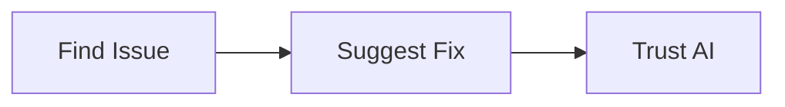

### BobSpot

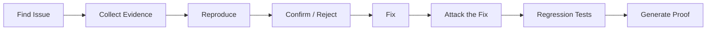

> BobSpot is not trying to generate **more review comments**.
>
> It is trying to make important review findings **more trustworthy and reproducible**.

---

# Demo Flow

The intended hackathon demonstration can show both sides of verification:

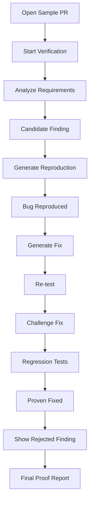

Two findings can demonstrate two outcomes:

```text
Finding A
AI Claim → Reproduced → Fixed → Verified → PROVEN FIXED

Finding B
AI Claim → Tested → Contradicted → REJECTED
```

---

# Future Direction

Potential extensions include:

- Native GitHub App integration
- Evidence-backed PR review comments
- More programming languages
- Deeper security verification
- CI/CD integration
- Persistent verification history
- Repository-specific verification policies
- Organization-level verification agents
- Human approval gates
- Verification analytics

These are future possibilities, not current guarantees.

---

# Design Principles

### 1. Evidence before confidence

Prefer observable execution results over unsupported confidence scores.

### 2. Reproduce before fixing

Whenever practical, establish the failure before generating a patch.

### 3. Verify the verifier

Challenge generated fixes instead of assuming they are correct.

### 4. Preserve human visibility

Developers should be able to inspect claims, tests, code evidence, patches, and results.

### 5. Reject unsupported findings

The system must be capable of concluding that an original suspicion was not supported.

### 6. Keep the MVP focused

The hackathon goal is not to build another GitHub.

The goal is to demonstrate:

```text
Claim → Evidence → Reproduction → Fix → Challenge → Regression → Proof
```

---

# Contributing

Contributions, bug reports, documentation improvements, and design suggestions are welcome.

## Contribution Flow

```bash
git checkout -b feature/your-feature
```

Make your changes and run relevant checks:

```bash
pytest
```

```bash
npm run lint
npm run build
```

Commit:

```bash
git commit -m "feat: describe your change"
```

Push:

```bash
git push origin feature/your-feature
```

Then open a Pull Request explaining:

- What changed
- Why it changed
- How you tested it

Please keep pull requests focused and avoid unrelated refactoring.

---

# Reporting Issues

When reporting a bug, include where possible:

```text
Environment:
Operating System:
Frontend/Backend:
Repository language:
PR being analyzed:

Expected behavior:

Actual behavior:

Steps to reproduce:

Relevant logs:
```

**Never include API keys, access tokens, passwords, or other secrets in an issue.**

---

<div align="center">

# BobSpot

### **Don't just review the code. Prove the review.**

<br/>

**Claim → Evidence → Reproduction → Fix → Challenge → Regression → Proof**

<br/>

Built with **IBM Bob** for the **IBM Bob 2.0 Hackathon**.

</div>
