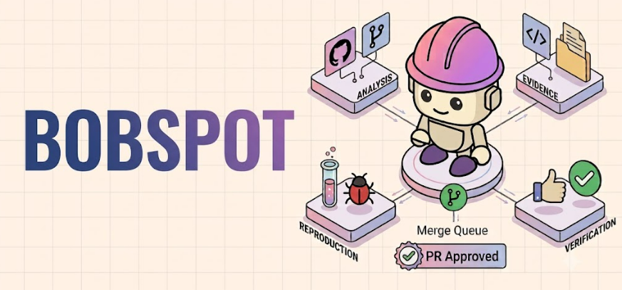
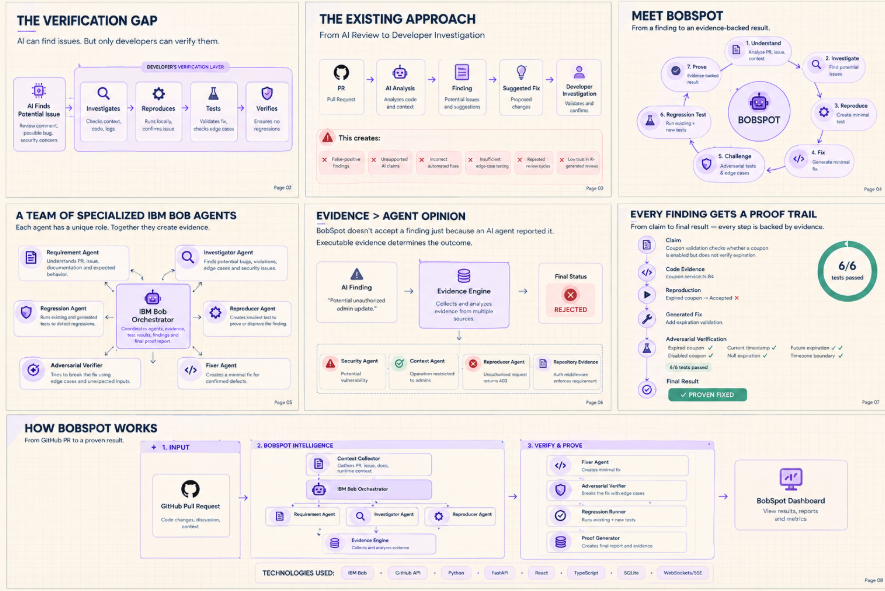

# BobSpot

### **Spot it. Test it. Prove it.**
<p align="center">
  
</p>

BobSpot is an **evidence-backed, multi-agent pull request verification system powered by IBM Bob**.

AI coding assistants can generate and review code quickly, but an AI-generated review comment is still just a **claim** until it is verified.

BobSpot adds a verification layer that investigates potential issues, collects code-level evidence, reproduces suspected bugs, generates fixes, challenges those fixes with adversarial tests, and runs regression checks before presenting the developer with a final result.

> **Claim → Evidence → Reproduction → Fix → Challenge → Regression → Proof**

Built with **IBM Bob** for the **IBM Bob 2.0 Hackathon**.

---

## The Problem

AI-assisted development has made writing and reviewing code much faster.

But when an AI reviewer says:

> "This change can allow an expired coupon to be accepted."

the developer still has to investigate:

* Is the issue actually real?
* Which code causes it?
* Can it be reproduced?
* Does the proposed fix actually work?
* What edge cases could break the fix?
* Did the fix introduce a regression?

Traditional AI review often looks like:

```text
Pull Request
     ↓
AI analyzes diff
     ↓
AI generates finding
     ↓
AI suggests fix
     ↓
Developer verifies manually
```

This can lead to:

* False-positive findings
* Unnecessary investigation
* Incorrect fixes
* Missing edge cases
* Regression risk
* Lower trust in AI-assisted development

### The question is no longer just:

> **Can AI review the code?**

### It is:

> **Can AI prove that its review is correct?**

---

# The Solution

BobSpot turns an AI-generated review into an **evidence-backed verification workflow**.

```text
Pull Request
     ↓
Understand Requirements
     ↓
Investigate Code
     ↓
Candidate Findings
     ↓
Collect Evidence
     ↓
Reproduce
     │
     ├── Cannot reproduce
     │       ↓
     │   REJECTED / UNVERIFIED
     │
     └── Reproduced
             ↓
         Generate Fix
             ↓
      Re-run Reproduction
             ↓
     Adversarial Verification
             ↓
       Regression Testing
             ↓
        Evidence Report
```

The fundamental principle is:

> **A claim is not a confirmed finding until evidence supports it.**

BobSpot can also reject its own agents' findings when executable evidence or repository context contradicts the original claim.

---

# How It Works

BobSpot uses specialized IBM Bob agents, each with a focused responsibility.

```text
                       Bob Orchestrator
                              │
        ┌─────────────────────┼─────────────────────┐
        ↓                     ↓                     ↓
 Requirement            Investigator          Reproducer
    Agent                   Agent                 Agent
        └─────────────────────┼─────────────────────┘
                              ↓
                       Evidence Engine
                              ↓
                            Fixer
                              ↓
                    Adversarial Verifier
                              ↓
                      Regression Agent
                              ↓
                       Proof Generator
```
## Workflow

<p align="center">
  
</p>

## 1. Requirement Agent

First, BobSpot determines what the pull request is actually supposed to accomplish.

It analyzes:

* PR description
* Issue description
* README/documentation
* Repository conventions
* Acceptance criteria
* Changed files

Example:

```json
{
  "requirement": "Expired coupons must be rejected",
  "affected_modules": [
    "coupon.service.ts"
  ],
  "acceptance_criteria": [
    "active coupon accepted",
    "expired coupon rejected"
  ]
}
```

This gives the rest of the verification pipeline the correct context.

---

## 2. Investigator Agent

The Investigator searches the changed code for potential problems.

It looks for:

* Logical bugs
* Requirement violations
* Edge cases
* Error-handling problems
* Security issues
* Unexpected side effects

Example:

```text
Finding:
Expired coupons may still be accepted.

Evidence:
coupon.service.ts:84

Reason:
The validation checks whether the coupon is enabled
but does not compare expiresAt with the current time.
```

At this stage, the finding is only a **candidate**.

```text
Candidate ≠ Confirmed
```

---

## 3. Reproducer Agent

The Reproducer attempts to prove or disprove the finding.

It generates the smallest useful test scenario.

Example:

```text
Scenario:
Coupon expired yesterday

Expected:
CouponRejectedError

Actual:
Coupon accepted

Result:
✓ ISSUE REPRODUCED
```

If the issue cannot be reproduced, BobSpot does not treat the AI claim as a confirmed defect.

---

## 4. Fixer Agent

Once a finding has sufficient evidence, the Fixer generates a minimal patch.

The Fixer follows three principles:

* Make the smallest reasonable change
* Preserve existing architecture
* Avoid unrelated refactoring

Example:

```diff
 if (!coupon.enabled)
     throw new InvalidCoupon()

+if (coupon.expiresAt < new Date())
+    throw new ExpiredCoupon()

 return applyDiscount(coupon)
```

---

## 5. Adversarial Verifier

The Fixer is **not automatically trusted**.

The Adversarial Verifier tries to break the proposed solution.

For the coupon example:

```text
✓ Expired coupon
✓ Current timestamp
✓ Future expiration
✓ Disabled coupon
✓ Null expiration
✓ Timezone boundary
```

The verifier asks:

> **What inputs could still make this fix fail?**

This creates a second verification layer after the fix.

---

## 6. Regression Agent

BobSpot runs existing repository tests alongside generated verification tests.

```text
Existing Tests       47/47 PASS
Reproduction Tests     1/1 PASS
Adversarial Tests     6/6 PASS
```

This helps detect whether the fix introduced a regression elsewhere in the codebase.

---

# Evidence > Agent Agreement

BobSpot does not simply majority-vote between agents.

Consider:

```text
Security Investigator
⚠ Potential vulnerability

Context Agent
✓ Authentication middleware exists

Reproducer
✕ Unauthorized request returns HTTP 403
```

Instead of asking which agent has more votes, BobSpot evaluates the available evidence.

```text
Executable evidence contradicts
the original claim.

FINAL STATUS: REJECTED
```

The goal is not to make AI agents agree.

The goal is to determine **what the evidence actually supports**.

---

# Finding Lifecycle

Every finding follows a defined state machine:

```text
CANDIDATE
    ↓
INVESTIGATING
    ↓
 ┌───────────────┐
 ↓               ↓
PROVEN      NOT REPRODUCED
 ↓               ↓
FIXING       REJECTED /
 ↓           UNVERIFIED
VERIFYING
 ↓
 ┌──────────────┐
 ↓              ↓
PROVEN FIXED   FIX FAILED
```

### CANDIDATE

Potential issue identified by an agent.

### PROVEN

The suspected defect was successfully reproduced.

### REJECTED

Available evidence contradicts the original claim.

### UNVERIFIED

There is insufficient evidence to confidently confirm or reject the claim.

### PROVEN FIXED

The defect was reproduced before the patch, cannot be reproduced after the patch, and verification checks pass.

### FIX FAILED

The original defect remains or the proposed fix fails verification.

---

# Example: From Claim to Proof

Suppose a pull request adds coupon validation.

The Investigator identifies:

> **Expired coupons can still be accepted.**

### 1. Code Evidence

```text
coupon.service.ts:84
```

The validation checks whether the coupon is enabled but does not validate expiration.

### 2. Reproduction

```text
Expired coupon
Expected: Rejected
Actual: Accepted

❌ BUG REPRODUCED
```

### 3. Fix

BobSpot generates a minimal patch adding expiration validation.

### 4. Adversarial Verification

```text
Expired coupon       ✓
Current timestamp    ✓
Future expiration    ✓
Disabled coupon      ✓
Null expiration      ✓
Timezone boundary    ✓
```

### 5. Regression

```text
Existing Tests        47/47 ✓
Generated Tests         7/7 ✓
```

### Final Result

```text
✓ PROVEN FIXED
```

Instead of receiving only a review comment, the developer receives the **claim, evidence, tests, patch, and verification trail**.

---

# Example: Rejecting a False Positive

BobSpot should also be able to prove that a finding is not supported by the repository.

Example:

> **Potential null pointer in UserService**

The Investigator identifies a possible null user object.

The Reproducer cannot reproduce the problem.

BobSpot then discovers that authentication middleware guarantees a populated user object for the relevant route.

Generated tests:

```text
5/5 PASS
```

Final result:

```text
✕ REJECTED
```

Reason:

```text
The original finding did not account for
the authentication middleware contract.
```

This prevents the system from treating every AI-generated warning as a real defect.

---

# Product Experience

BobSpot is designed as a developer verification workspace rather than a chatbot.

## Verification Dashboard

```text
PR #42 — Add coupon expiration validation

6 files changed
+143 -27

VERIFICATION: RUNNING
```

Summary:

```text
7 Findings
4 Proven
2 Rejected
1 Investigating

55 / 55 Tests Passed
```

---

## Live Agent Activity

The verification pipeline is visible in real time:

```text
Verification Pipeline

Requirement Agent       ✓ COMPLETE
        ↓
Investigator             ✓ COMPLETE
        ↓
Reproducer               ✓ COMPLETE
        ↓
Fixer                    ✓ COMPLETE
        ↓
Adversarial Verifier     ● RUNNING
        ↓
Regression Agent         ○ WAITING
        ↓
Proof Report             ○ WAITING
```

Developers can inspect the progress of individual agents instead of receiving a black-box final answer.

---

# Evidence-Backed Findings

Each finding provides a complete proof trail.

```text
┌────────────────────────────────────────────┐
│ HIGH                 PROVEN FIXED          │
│                                            │
│ Expired coupons can be accepted            │
│                                            │
│ coupon.service.ts : 84                     │
│                                            │
│ Reproduced       ✓                         │
│ Fix applied      ✓                         │
│ Adversarial      6/6                       │
│ Regression       47/47                     │
│                                            │
│ [ View Proof ] [ View Patch ]              │
└────────────────────────────────────────────┘
```

A finding can contain:

* Claim
* Code evidence
* Reproduction test
* Before-fix result
* Proposed patch
* Adversarial tests
* Regression results
* Final status

---

# Verification Timeline

BobSpot maintains an audit trail of the verification process.

```text
10:41:02  PR analysis started
10:41:05  Requirements extracted
10:41:09  Finding #03 identified
10:41:14  Reproduction test generated
10:41:17  Test failed — bug confirmed
10:41:23  Patch generated
10:41:27  Reproduction test passed
10:41:32  Adversarial tests generated
10:41:38  6/6 adversarial tests passed
10:41:44  Regression suite completed
10:41:45  Finding marked PROVEN FIXED
```

This makes the verification process inspectable and auditable.

---

# Verification Report

At the end of a run, BobSpot generates a consolidated report.

```text
BobSpot Verification Report

Repository: shop-api
Pull Request: #42

Potential Findings       9
Proven                    5
Rejected                  3
Unverified                1

Fixes Generated           5
Fixes Verified            5

Generated Tests          18
Tests Passed             18

Existing Tests          47/47
```

The report contains:

* Findings
* Code evidence
* Reproduction results
* Generated patches
* Adversarial scenarios
* Regression results
* Final statuses
* Verification timeline

The developer remains in control of the final merge decision.

---

# Architecture

```text
                         GitHub
                           │
                           ▼
                    BobSpot Backend
                           │
                           ▼
                  Context Collector
                           │
                           ▼
                   Bob Orchestrator
                           │
       ┌───────────────────┼───────────────────┐
       ▼                   ▼                   ▼
 Requirement         Investigator          Reproducer
    Agent                Agent                 Agent
       └───────────────────┼───────────────────┘
                           ▼
                    Evidence Engine
                           │
                           ▼
                         Fixer
                           │
                           ▼
                 Adversarial Verifier
                           │
                           ▼
                   Regression Runner
                           │
                           ▼
                    Proof Generator
                           │
                           ▼
                       React UI
```

---

# Tech Stack

### Frontend

* React
* TypeScript
* Vite
* Tailwind CSS
* shadcn/ui
* Lucide Icons
* React Flow
* Framer Motion

### Backend

* Python
* FastAPI
* Pydantic
* GitHub API
* SQLite
* Subprocess / Test Runner
* WebSockets / Server-Sent Events

### Agent Layer

* **IBM Bob**
* Specialized verification agents
* Bob Orchestrator
* Evidence-driven agent workflow

---

# Project Structure

```text
bobspot/
│
├── backend/
│   ├── main.py
│   ├── requirements.txt
│   └── ...
│
├── frontend/
│   ├── src/
│   │   ├── App.tsx
│   │   ├── components/
│   │   ├── pages/
│   │   ├── lib/
│   │   └── ...
│   ├── package.json
│   └── ...
│
├── README.md
└── ...
```

---

# Getting Started

## Prerequisites

* Python 3.10+
* Node.js 18+
* npm
* Git
* A GitHub repository containing a pull request
* IBM Bob environment/configuration used by the project

## Clone

```bash
git clone <your-repository-url>
cd bobspot
```

## Start the Backend

```bash
cd backend

pip install -r requirements.txt

uvicorn main:app --reload --port 8000
```

Backend:

```text
http://localhost:8000
```

Health check:

```text
http://localhost:8000/api/health
```

## Start the Frontend

Open another terminal:

```bash
cd frontend

npm install

npm run dev
```

Frontend:

```text
http://localhost:5173
```

---

# Configuration

Create a local `.env` file:

```env
GITHUB_TOKEN=your_github_token
GITHUB_API_URL=https://api.github.com

BACKEND_URL=http://localhost:8000

# IBM Bob configuration
BOB_API_KEY=your_bob_configuration
```

Never commit API keys, GitHub tokens, or other secrets.

Add `.env` to `.gitignore`.

---

# API

The backend exposes endpoints for verification runs, findings, evidence, tests, patches, agent activity, and reports.

```text
POST /api/verify

GET /api/pr/{id}
GET /api/pr/{id}/findings
GET /api/pr/{id}/agents
GET /api/pr/{id}/timeline
GET /api/pr/{id}/report

GET /api/findings/{id}
GET /api/findings/{id}/evidence
GET /api/findings/{id}/tests
GET /api/findings/{id}/patch

WS /api/verification/{id}/stream
```

The verification stream allows the frontend to display agent activity as the workflow progresses.

---

# Scope

BobSpot focuses on demonstrating the **verification workflow** rather than replacing GitHub or enterprise CI/CD systems.

The core workflow covers:

* Pull request analysis
* Requirement understanding
* Candidate finding generation
* Evidence collection
* Reproduction
* Fix generation
* Adversarial verification
* Regression testing
* Evidence-backed statuses
* Agent activity
* Proof reports

### Not the goal

BobSpot does not attempt to:

* Replace GitHub or GitLab
* Replace enterprise CI/CD
* Analyze every programming language
* Guarantee correctness of arbitrary programs
* Automatically merge production pull requests
* Make final code-ownership decisions

---

# What's Different?

### Traditional AI Review

```text
Find issue
    ↓
Suggest fix
    ↓
Trust AI
```

### BobSpot

```text
Find issue
    ↓
Collect evidence
    ↓
Reproduce
    ↓
Confirm / Reject
    ↓
Fix
    ↓
Attack the fix
    ↓
Run regression tests
    ↓
Generate proof
```

BobSpot is not trying to generate **more review comments**.

It is trying to make important review findings **more trustworthy and reproducible**.

---

# Future Direction

Potential extensions include:

* Native GitHub PR integration
* Evidence-backed PR review comments
* More programming languages
* Deeper security verification
* CI/CD integration
* Persistent verification history
* Repository-specific verification policies
* Organization-level verification agents
* Human approval gates
* Verification analytics

---

# The Core Idea

AI is becoming increasingly capable of writing and reviewing software.

The next challenge is determining **which AI claims deserve to be trusted**.

BobSpot explores a simple idea:

> **An AI-generated review should not stop at a claim. It should produce evidence.**

```text
CLAIM
  ↓
EVIDENCE
  ↓
REPRODUCTION
  ↓
FIX
  ↓
ADVERSARIAL VERIFICATION
  ↓
REGRESSION
  ↓
PROOF
```

## **BobSpot**

### **Don't just review AI-generated code. Prove the review.**

